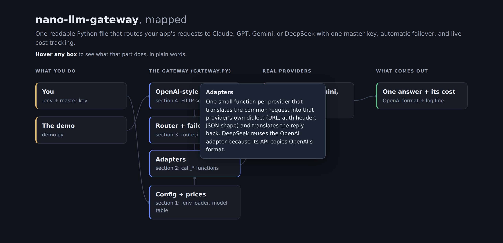

# vibediary: your AI coding sessions, written down in plain English

One command in Claude Code turns your sessions into a project diary, living docs, and a visual map you can understand in 5 minutes.


A builder went viral for deleting 3 months of AI-generated code. The project worked, but he couldn't explain his own code anymore. Here's the thing: your code only holds the WHAT. The WHY (what you asked for, what broke, why things ended up this way) lives in your coding sessions, and normally it's lost the moment you close the terminal. vibediary reads your Claude Code sessions and writes that story down, in words a beginner can follow.

## Quickstart

```bash
git clone https://github.com/reezanahamed/vibediary ~/.claude/skills/vibediary
```

Then open Claude Code inside any project and run:

```
/vibediary
```

Done. Look in your project's `docs/` folder.

## What you get

| File | What it is |
|---|---|
| `docs/diary.md` | dated entries in plain English: what got built, what broke, and why decisions were made |
| `docs/how-it-works.md` | a living explanation of your whole project, kept current every run |
| `docs/map.html` | a visual map of your project; hover any part to see what it does in simple words |

The map, generated for a real project:



Optional auto mode: a small hook runs `/vibediary` when a session ends, so the docs never fall behind. Setup is one snippet, see below.

## Auto mode (optional)

Claude Code fires a SessionEnd hook when a session finishes. Put this in the project's `.claude/settings.json` and the diary updates itself every time you close a session there:

```json
{
  "hooks": {
    "SessionEnd": [
      {
        "hooks": [
          {
            "type": "command",
            "command": "[ -n \"$VIBEDIARY_AUTO\" ] || VIBEDIARY_AUTO=1 claude -p \"/vibediary\" --permission-mode acceptEdits --allowedTools Bash",
            "timeout": 600
          }
        ]
      }
    ]
  }
}
```

The `VIBEDIARY_AUTO` guard matters: the hook itself starts a Claude session, and without the guard that session's end would fire the hook again, forever. With it, the inner session inherits the variable and stops the chain.

Honest cost note: every auto-run is a real Claude session and spends tokens from your plan, roughly a short task's worth each time. If you close sessions often, run `/vibediary` by hand instead.

## How it works

Claude Code already saves every session as a transcript file on your machine. vibediary runs a small script that condenses those transcripts (your prompts, the file changes, the commands that ran), then Claude writes the three docs from that story plus the current code. A state file remembers which sessions are already in the diary, so re-running only adds what's new. Nothing leaves your machine except the normal Claude Code API calls you're already making.

## Limitations

- Claude Code only. It reads Claude Code's session files; Cursor, Copilot, and Codex sessions aren't supported.
- The diary only knows what happened in sessions. Manual edits made outside Claude Code won't show up.
- Reading good docs is not the same as understanding your code. vibediary shrinks the gap, it doesn't close it.
- Each run costs tokens from your Claude Code plan, roughly one short task's worth.
- Claude Code's transcript format is undocumented; a big Claude Code update could require a fix here.
- The diary repeats what you typed in sessions. If you discussed keys, emails, or private plans there, they can end up in `docs/`. Review before publishing, or add `docs/` to `.gitignore`.

## License

MIT
